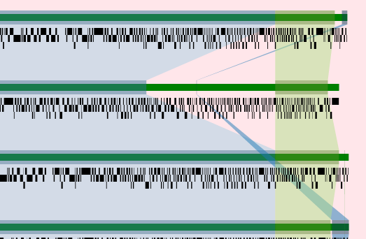
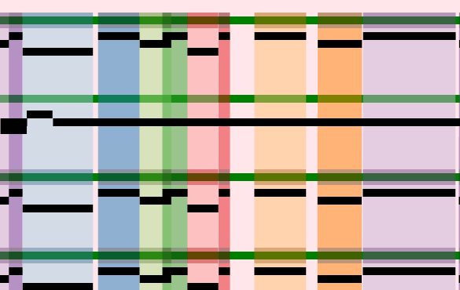

# Mauve Visualization in D3.js

An experimental replacement for the desktop Mauve software. This repo provides
tooling to process XMFA+fasta+gff3 datasets into convenient and fast web-based
visualizations.

It is currently a work-in-progress, it will not be a feature-for-feature
re-implementation of the original Mauve.

## Steps on how to run

1. get fasta and gff3 files for each genome
2. use rename tool to rename both files with desired display name
3. use concatenate tool for fasta files; use concatenate tool for gff3 files
4. use remove description tool on concatenated fasta file
5. make blast db out of CDSs in fasta file
6. run these CDSs against the blast db at desired cutoff
7. run blast2pxmfa
8. run cluster_lcbs tool

Input for this tool is that xmfa from #8, #4, and concatenated gff3 file

## Screenshots

Standard nucleotide level mauve visualization. Click on regions causes re-alignment to that region.

Experimental protein level visualization.

## License

AGPLv3
